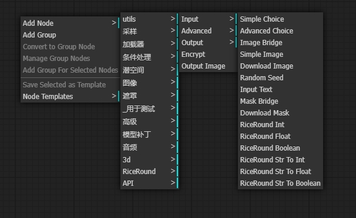
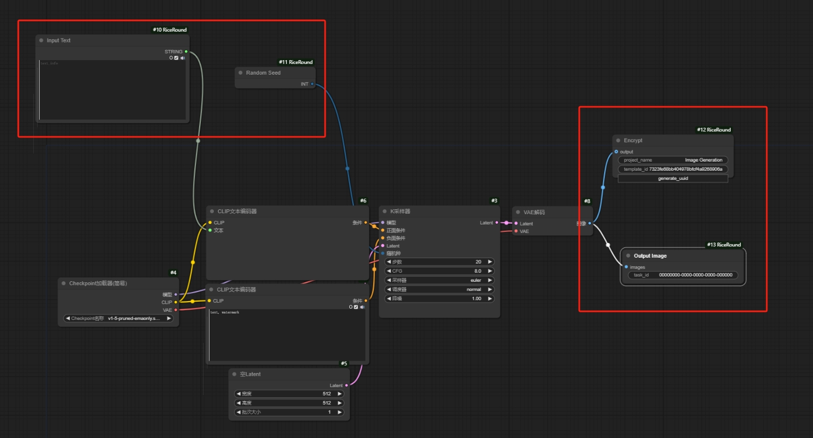
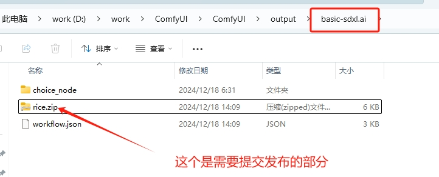
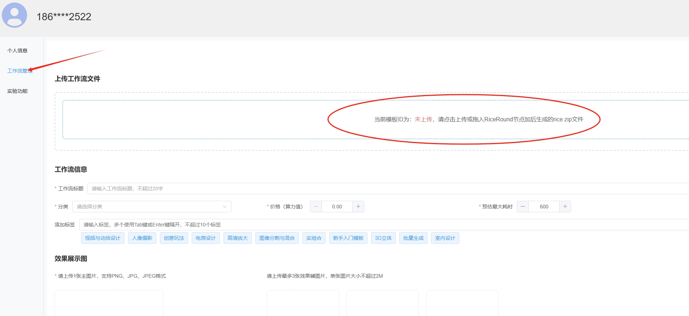
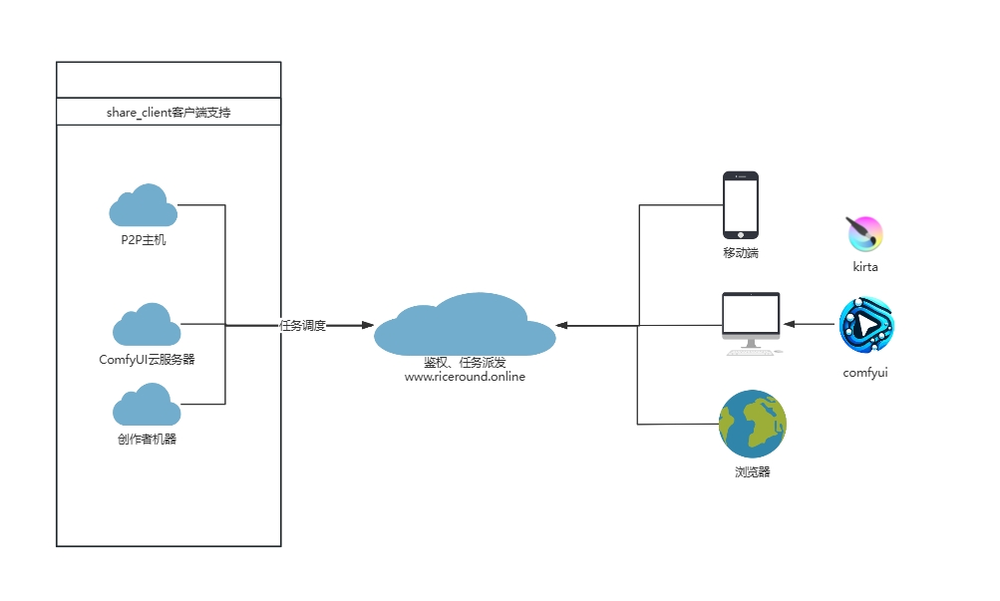

# ComfyUI_RiceRound
One-click generation of encrypted nodes and online pages for ComfyUI commercialization tool.

## 简介 (Introduction)
ComfyUI_RiceRound 是一个将 ComfyUI 工作流转换为加密节点和在线页面的工具，平台本身免费使用。支持使用者（创作者）：
- 按运行次数收费
- 长期授权（计划中）
- 团队授权（计划中） 

同时，在稳定版发布后，平台计划支持独立部署。

## 快速上手 (Quick Start)

### 环境要求
- 已安装 ComfyUI
- Windows 系统（Linux 版本即将推出）

### 安装步骤

简易视频可以参考这里
https://youtu.be/RAQeFBZJ45Y

1. **下载并安装客户端**
   - [直接下载](https://github.com/RiceRound/ComfyUI_RiceRound/releases/download/1.0.0.0/riceround_setup.zip)
   - [百度网盘](https://pan.baidu.com/s/1GQ_JUWarN-zI_J89PUlMkA?pwd=b2r6) (提取码: b2r6)

   > ⚠️ 安装过程需要手动重启 ComfyUI 服务，务必确保按提示操作。

2. **创建加密工作流**
   - 使用 RiceRound 提供的 input 节点
   - 添加 RiceRoundEncryptNode 和 RiceRoundOutputImageNode
   - 参考示例：[original.json](https://github.com/RiceRound/ComfyUI_RiceRound/blob/main/demo/original.json)

   > ⚠️ 切记不能用RiceRound下面的output节点，只能用input、RiceRoundEncryptNode、RiceRoundOutputImageNode。

   
   

3. **部署工作流**
   - 运行工作流，在 output 文件夹项目子文件夹下生成 rice.zip 和 workflow.json
   - 访问 [RiceRound 官网](https://www.riceround.online)
   - 在[个人中心](https://www.riceround.online/personal)上传 rice.zip

   
   

4. **验证部署**
   - 使用生成的 workflow.json 测试运行
   - 在网站查看已部署的工作流

   

## 系统架构

系统通过任务调度平台连接：
- P2P 主机
- 云服务器
- 创作者终端

支持多平台访问：
- 移动端
- 桌面端
- 浏览器端

## 技术支持
如需最新版本或技术支持，请扫描下方二维码添加微信：

