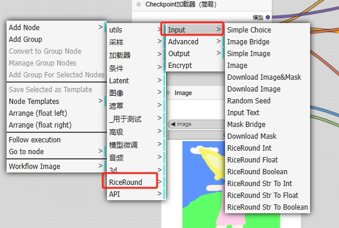
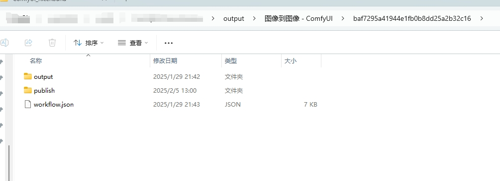

# ComfyUI_RiceRound

[](https://github.com/RiceRound/ComfyUI_RiceRound/stargazing)

> **📚 详细文档**: 访问 [https://help.riceround.online/](https://help.riceround.online/) 获取完整使用指南

> **⭐ 喜欢这个项目?** 请给我们的 [GitHub 仓库](https://github.com/RiceRound/ComfyUI_RiceRound) 点个星标支持我们!

## 简介

RiceRound 是一个开源项目，旨在将本地 AI 工作流（通过 ComfyUI 创建）转移到云端，支持分布式部署。创作者可以轻松设计并运行工作流，实时监控任务进度与节点状态。平台支持一键生成云节点与在线页面，创作者可直接通过单次付费进行操作，收入全部归创作者。

一键部署，同时生成在线页面和 ComfyUI 云端节点。

## 快速启动

### 1. 安装节点

#### 方法一：通过 ComfyUI-Manager 安装（推荐）
1. 打开 ComfyUI-Manager
2. 在搜索框中输入 "RiceRound"
3. 点击安装按钮完成安装

#### 方法二：通过 Git 克隆安装
```bash
cd ComfyUI/custom_nodes/
git clone https://github.com/RiceRound/ComfyUI_RiceRound
```

#### 方法三：手动下载安装
1. 下载 [ComfyUI_RiceRound 压缩包](https://github.com/RiceRound/ComfyUI_RiceRound/archive/refs/heads/main.zip)
2. 解压文件到 `ComfyUI/custom_nodes/` 目录
3. 重启 ComfyUI 使节点生效

### 2. 搭建工作流

⚠️ **重要提示**: 只使用 RiceRound -> input 里面的节点，Output 节点是用来排查部署问题使用的。



### 3. 发布工作流

在工作流尾部加上 RiceRound Publish 节点用于发布，然后点击运行。


### 4. 查看结果

会在 output 文件夹生成一些加密工作流文件，其中 workflow.json 就是你拿去发布的加密工作流。



### 5. 管理工作流

在 [https://www.riceround.online/](https://www.riceround.online/) 可以管理你的工作流，也可以看见工作流生成的页面。


## 客户端节点部署

### Windows 平台
- 下载 [share_client_windows_setup.exe](https://github.com/RiceRound/ComfyUI_RiceRound/releases) 全量安装包（带图形界面和启停管理）
- 或使用命令行绿色工具（将 share_client_windows.exe 重命名为 riceround-client）

### Linux/MacOS 平台
- 下载对应平台的客户端
- 运行命令：`./riceround-client`

更多详细安装和配置说明，请访问 [https://help.riceround.online/](https://help.riceround.online/)

## 核心功能

- 🚀 **云节点与页面生成**: 一键生成云节点，自动展示在线页面
- 🌐 **分布式部署与自动扩展**: 支持多机器部署，智能化资源调度
- 💰 **收入分配透明**: 支持单次付费模式，创作者直接获得收入
- 🔓 **开源计划**: 逐步开放源代码，支持社区共建发展

## 常见问题

如遇问题，可查看日志文件进行排查：

- Windows: `C:\Users\<用户名>\RiceRound\logs\`
- macOS: `/Users/<用户名>/RiceRound/logs/`
- Linux: `/home/<用户名>/RiceRound\logs\`

## 持续更新中

有时候教程、演示文件没有来得及更新，请联系我微信。


