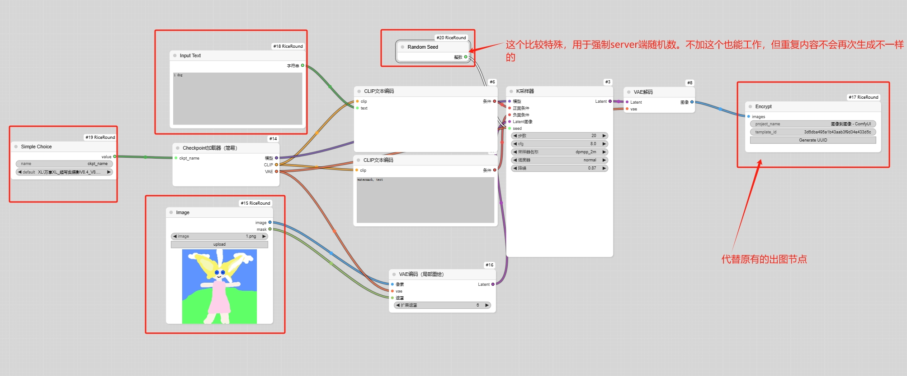

# ComfyUI_RiceRound
 One-click generation of encrypted nodes and online pages for ComfyUI commercialization tool.

 ## 这个项目还没有完全完工，目前在内测阶段，先不做笼统的介绍：

 1、安装节点，git拉取也行，zip下载后解压到custom_nodes文件夹也行，如果你已经安装过comfy-cli，可以直接在终端中输入comfy node registry-install comfyui_riceround，然后重启comfyui

 2、[下载share_client.exe](docs/share_client.zip)文件，然后去www.riceround.online注册用户，在个人中心生成一个token，复制到client.toml文件中，另外特别注意要填写WorkingDirectory和PythonPath。也可以通过[百度网盘下载](https://pan.baidu.com/s/1Tq5zQXvLVgTCQXthC5Lt3A?pwd=5ndz)，提取码: 5ndz

 3、搭建工作流，注意用riceround里面的input节点，在尾部加上RiceRoundEncryptNode和RiceRoundOutputImageNode，然后点击运行，会在output文件夹生成一些加密工作流文件，其中workflow.json就是你拿去发布的加密工作流。

 

 4、在www.riceround.online的我的工作流页面，点击创建工作流，上传rice.zip。

 5、同时可以在页面和comfyui发布你的工作流了。

  

 ## 持续在更新，有时候教程、演示文件没有来得及更新，请联系我微信。

